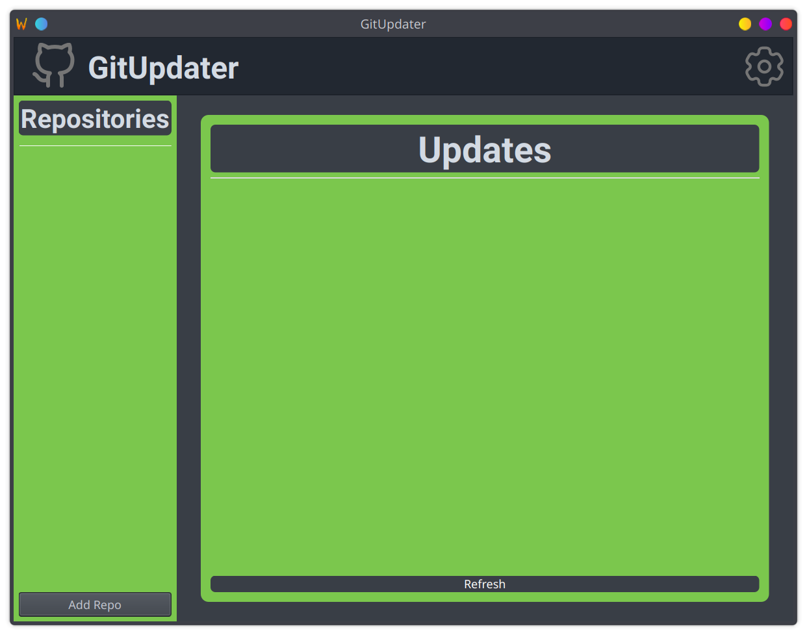
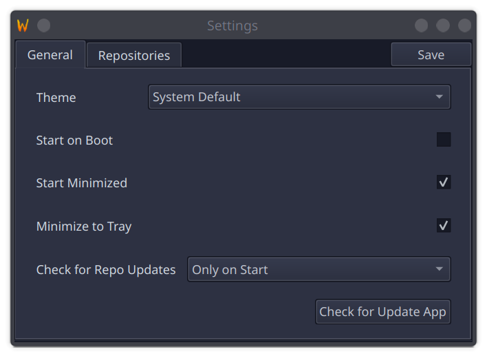
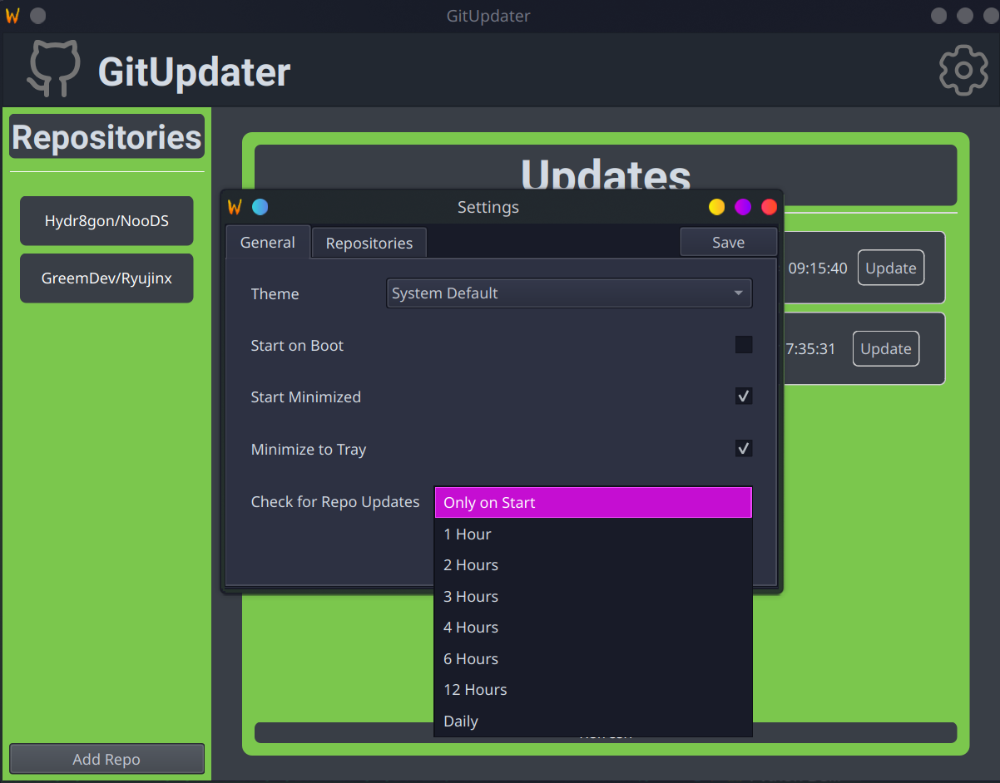
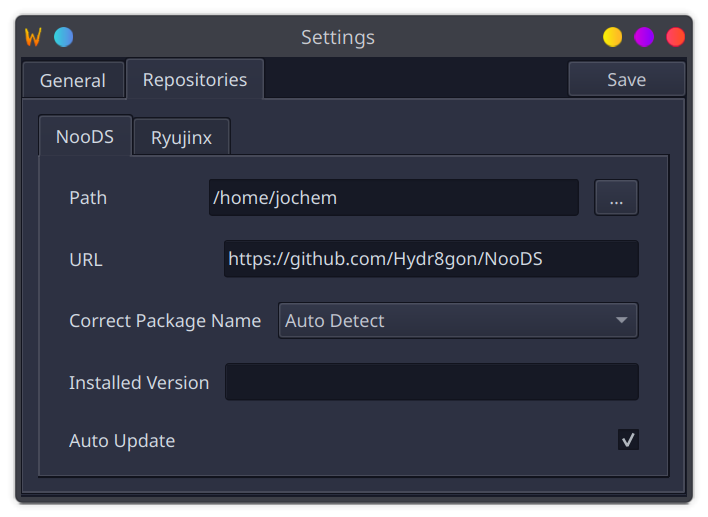
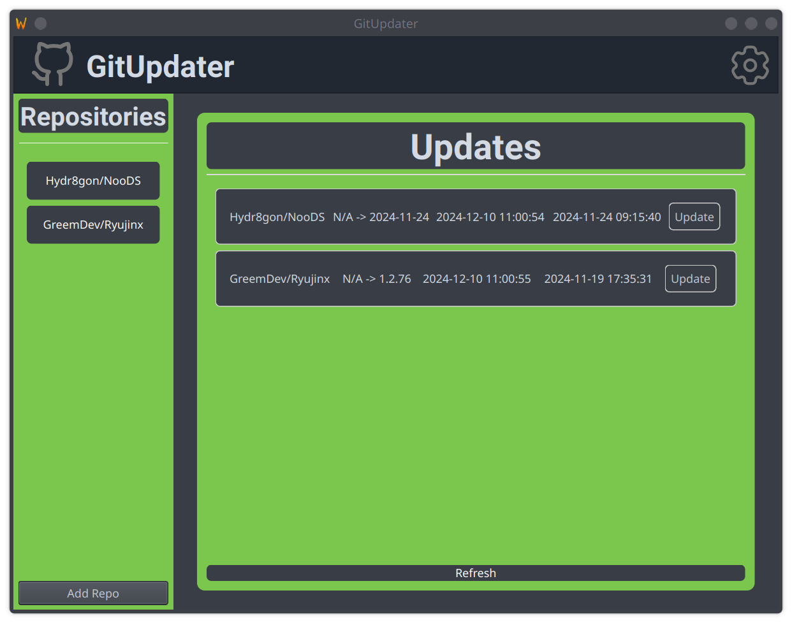

# GitUpdater

A PyQt6-based application that automatically tracks and updates software from GitHub releases.

## Features

- Track multiple GitHub repositories
- Automatic version detection
- OS and architecture-specific downloads
- System tray integration
- Custom update paths
- Auto-update option per repository

## Installation

### From Release

1. Download the latest release from the [releases page](https://github.com/JochemKuipers/GitUpdater/releases)
2. Extract the archive
3. Run GitUpdater

### From Source

```bash
# Clone the repository
git clone https://github.com/JochemKuipers/GitUpdater.git
cd GitUpdater

# Create virtual environment
python -m venv .venv
source .venv/bin/activate  # On Linux/Mac
# or
.venv\Scripts\activate  # On Windows

# Install dependencies
pip install -r ./requirements.txt

# Run the application
python ./main.py
```

## Configuration

GitUpdater stores its configuration in `~/.config/gitupdater/` (Linux) containing:

- `config.json`: Application settings
- `repos.json`: Repository tracking data

### Adding Repositories

1. Click "Add Repo" button
2. Enter GitHub repository URL
3. Select installation directory
4. Enable/disable auto-update
5. Click OK to add

### Package Name Matching

For repositories with multiple assets, GitUpdater will:

1. Auto-detect OS/architecture appropriate files
2. Allow manual selection of correct package
3. Remember selection for future updates

## Requirements

- Python 3.8+
- PyQt6
- Cronie (linux only)
- GitHub API access
- Internet connection

## Building

```bash
# Install PyInstaller
pip install pyinstaller

# Build executable
pyinstaller main.spec
```

## Contributing

1. Fork the repository
2. Create your feature branch (`git checkout -b feature/amazing-feature`)
3. Commit your changes (`git commit -m 'Add some amazing feature'`)
4. Push to the branch (`git push origin feature/amazing-feature`)
5. Open a Pull Request

### Development Guidelines

- Follow PEP 8 style guide
- Add docstrings to new functions/classes
- Include unit tests for new features
- Update documentation as needed

## License

This project is licensed under the MIT License - see the [LICENSE](LICENSE) file for details.

## Screenshots

### Main Window



### Settings Window





### Update Available


